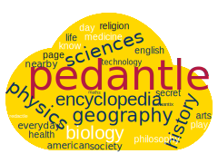

<a name="readme-top"></a>

[![Contributors][contributors-shield]][contributors-url]
[![Forks][forks-shield]][forks-url]
[![Stargazers][stars-shield]][stars-url]
[![Issues][issues-shield]][issues-url]
[![LinkedIn][linkedin-shield]][linkedin-url]


<!-- PROJECT LOGO -->
<br />
<div align="center">
  <a href="https://github.com/GabrielBeFr/Pedantle-RL">
    
  </a>

<h3 align="center">Agentle - Playing Pedantle with RL</h3>

  <p align="center">
    CentraleSupélec - Reinforcement Learning Project - 2024
    <br />
    <a href="https://github.com/GabrielBeFr/Pedantle-RL"><strong>Explore the docs »</strong></a>
    <br />
  </p>
</div>


<!-- TABLE OF CONTENTS -->
<details>
  <summary>Table of Contents</summary>
  <ol>
    <li>
      <a href="#about-the-project">About The Project</a>
      <ul>
        <li><a href="#built-with">Built With</a></li>
      </ul>
    </li>
    <li>
      <a href="#getting-started">Getting Started</a>
      <ul>
        <li><a href="#installation">Installation and Usage</a></li>
      </ul>
    </li>
    <li><a href="#contact">Contact</a></li>
    <li><a href="#acknowledgments">Acknowledgments</a></li>
  </ol>
</details>


<!-- ABOUT THE PROJECT -->
## About The Project

[Pedantle](https://cemantle.certitudes.org/pedantle) is a game part of the [cemantle games](https://cemantle.certitudes.org/), a collection of games on words. 

The first game to appear was [Semantle](https://semantle.com/), created by David Turner. The game is a words game, where the goal is to find the random word of the day. The player can submit any amount of words, and the game will tell him if how close his submitted word is to the random word of the day. The game is based on [word2vec](https://en.wikipedia.org/wiki/Word2vec), which maps any words of the english dictionnary (and even more, such as conjugated verbs or some family names). The word2vec used by Semantle is the Google one, available [here](https://code.google.com/archive/p/word2vec/).

[Enigmatix](https://twitter.com/enigmathix), inspired by Semantle, created [Cémantix](https://cemantix.certitudes.org/cemantix), the same game as Semantle but with French words. The Google word2vec being applicable only for english words, Cémantix is based on another word2vec, [the one of Jean-Philippe Fauconnier](https://fauconnier.github.io/#data). Cémantix was the first game of the Cémantix collection. Enigmatix launched another game, [Pédantix](https://cemantix.certitudes.org/pedantix), a game where the goal is to find the title of a random French wikipedia page each day. The player submits words and the game reveals how close this word is to the ones from the article. As Cémantix, the game is based on Fauconnier's word2vec.

Eventually, [Julie](https://twitter.com/cemantle), based on Pédantix, created [Pedantle](https://cemantle.certitudes.org/pedantle), the same game as Pédantix but with English wikipedia articles. The game is thus based on the Google word2vec, as Semantle. Julie also created [Cemantle](https://cemantle.certitudes.org/), the exact same game as Semantle but with Pedantle/Cémantix/Pédantix interface.

The goal of this project is to create an agent that can play Pedantle, using Reinforcement Learning. We made the pedantle environment from scratch, using the [gym](https://www.gymlibrary.dev/index.html) library. We use Google's word2vec to compute similarity between words. 

<p align="right">(<a href="#readme-top">back to top</a>)</p>


### Built With

* [![gym][gym.js]][gym-url]
* [![gensim][gensim.js]][gensim-url]
* [![faiss][faiss.js]][faiss-url]

<p align="right">(<a href="#readme-top">back to top</a>)</p>


<!-- GETTING STARTED -->
## Getting Started

To get a local copy of the project up and running, follow these few steps.

### Installation and Usage

1. Clone the repo
   ```sh
   git clone https://github.com/GabrielBeFr/Pedantle-RL.git
   ```
2. Install the above mentioned required packages
   ```sh
   pip install -r requirements.txt
   ```
3. Install the Pedantle environment
   ```sh
   pip install -e gym-examples
   ```
4. Download the pre-trained word2vec model [here](https://drive.google.com/file/d/0B7XkCwpI5KDYNlNUTTlSS21pQmM/edit?resourcekey=0-wjGZdNAUop6WykTtMip30g). You can find this file from [this Google Code Archive](https://code.google.com/archive/p/word2vec/), in the *Pre-trained word and phrase vectors* part. 
5. *(Optional - heavy in storage)* You can also download the true wikipedia dataset from the [Hugging Face](https://huggingface.co/) datasets library, [here](https://huggingface.co/datasets/wikipedia?viewer_api=true), by running the dataset_downloader.py file: 
   ```sh
   python dataset_downloader.py
   ```
6. **(Read carefully)** You have to create a faiss index to search words from the word2vec vocabulary quicker. By running the following command, you will initiate a (very) long and greedy process of faiss index construction. First, a small index named "word2vec_test.faiss" will be created. This should be fast. But the second index building should take a long time to finish. It thus advised that you end the process manually after having created the test index. However, for the agent to perform with the whole word2vec vocabulary, the large index is mandatory. 
   ```sh
   python faiss_index_maker.py
   ``` 
7. You can now run the main.py file to see the agent playing Pedantle:
   ```sh
   python main.py
   ```
   In the main.py file, you can change the parameters of the agent, such as the number of episodes, the number of steps per episode, the learning rate, etc. but also activate or deactivate the human display mode, the test mode, and change the wikipedia dataset path.
   Default is: 
   ```sh
    env = gym.make(
    "gym_examples/Pedantle-v0", 
    render_mode="human", # else None 
    test_model=True, 
    logging = logging,
    )
   ```
   If you want to run the agent with the whole vocabulary and the true wikipedia dataset, you can change to:
   ```sh
    env = gym.make(
    "gym_examples/Pedantle-v0", 
    render_mode=None, # else "human" 
    test_model=True, 
    wiki_file="data/wikipedia_dataset.csv",
    logging = logging,
    )
8. Eventually, you can visualize the results of the agent by running the following command:
   ```sh
    python results.py
   ``` 
   Don't forget to modify the results.py file with the correct path to the results file *(You should find it in the results/ directory)*.

<p align="right">(<a href="#readme-top">back to top</a>)</p>


<!-- CONTACT -->
## Contact

Project Link: [https://github.com/GabrielBeFr/Pedantle-RL](https://github.com/GabrielBeFr/Pedantle-RL)

<p align="right">(<a href="#readme-top">back to top</a>)</p>


<!-- ACKNOWLEDGMENTS -->
## Acknowledgments

* [GabrielBeFr](https://github.com/GabrielBeFr)
* [Chiararov](https://github.com/chiararov)
* [QuentinJGMace](https://github.com/QuentinJGMace)

<p align="right">(<a href="#readme-top">back to top</a>)</p>


<!-- MARKDOWN LINKS & IMAGES -->
<!-- https://www.markdownguide.org/basic-syntax/#reference-style-links -->
[contributors-shield]: https://img.shields.io/badge/Contributors-000000?style=for-the-badge
[contributors-url]: https://github.com/GabrielBeFr/Pedantle-RL/graphs/contributors
[forks-shield]: https://img.shields.io/badge/Forks-000000?style=for-the-badge
[forks-url]: https://github.com/GabrielBeFr/Pedantle-RL/network/members
[stars-shield]: https://img.shields.io/badge/Stars-000000?style=for-the-badge
[stars-url]: https://github.com/GabrielBeFr/Pedantle-RL/stargazers
[issues-shield]: https://img.shields.io/badge/Issues-000000?style=for-the-badge
[issues-url]: https://github.com/GabrielBeFr/Pedantle-RL/issues
[linkedin-shield]: https://img.shields.io/badge/-LinkedIn-black.svg?style=for-the-badge&logo=linkedin&colorB=555
[linkedin-url]: https://www.linkedin.com/in/gabriel-ben-zenou-69800a1b9/
[product-screenshot]: images/screenshot.png
[gym.js]: https://img.shields.io/badge/gym-000000?style=for-the-badge&logo=openaigym&logoColor=white
[gym-url]: https://www.gymlibrary.dev/index.html
[gensim.js]: https://img.shields.io/badge/gensim-000000?style=for-the-badge
[gensim-url]: https://radimrehurek.com/gensim/
[gym.js]: https://img.shields.io/badge/gym-000000?style=for-the-badge&logo=openaigym&logoColor=white
[gym-url]: https://www.gymlibrary.dev/index.html
[faiss.js]: https://img.shields.io/badge/faiss-000000?style=for-the-badge
[faiss-url]: https://github.com/facebookresearch/faiss