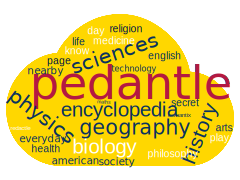

<!-- PROJECT LOGO -->
 

  

<h3 align="center">Agentle - Playing Pedantle with RL</h3>

  

    CentraleSupélec - Reinforcement Learning Project - 2024
     
    <a href="https://github.com/GabrielBeFr/Pedantle-RL"><strong>Explore the docs »</strong></a>
     
  

<!-- TABLE OF CONTENTS -->

  
Table of Contents

  <ol>
    <li><a href="#introduction">Introduction</a></li>
    <li><a href="#environment">Environment</a></li>
    <li>
      <a href="#classical-RL">Classical RL</a>
      <ul>
        <li><a href="#actions-and-state">Actions and States</a></li>
      </ul>
      <ul>
        <li><a href="#monte-carlo-algorithm">Monte Carlo Algorithm</a></li>
      </ul>
    </li>
    <li>
      <a href="#deep-RL">Deep RL</a>
      <ul>
        <li><a href="#Q-learning">Q-Learning</a></li>
      </ul>
      <ul>
        <li><a href="#neural-network-architecture">Neural Network Architecture</a></li>
      </ul>
    </li>
    <li><a href="#results">Results</a></li>
    <li><a href="#discussion">Discussion</a></li>
    <li><a href="#conclusion">Conclusion</a></li>
    <li><a href="#bibliography">Bibliography</a></li>
  </ol>

<!-- ABOUT THE PROJECT -->
## Introduction

[Pedantle](https://cemantle.certitudes.org/pedantle) is a game part of the [cemantle games](https://cemantle.certitudes.org/), a collection of games on words. 

The first game to appear was [Semantle](https://semantle.com/), created by David Turner. The game is a words game, where the goal is to find the random word of the day. The player can submit any amount of words, and the game will tell him if how close his submitted word is to the random word of the day. The game is based on [word2vec](https://en.wikipedia.org/wiki/Word2vec), which maps any words of the english dictionnary (and even more, such as conjugated verbs or some family names). The word2vec used by Semantle is the Google one, available [here](https://code.google.com/archive/p/word2vec/).

[Enigmatix](https://twitter.com/enigmathix), inspired by Semantle, created [Cémantix](https://cemantix.certitudes.org/cemantix), the same game as Semantle but with French words. The Google word2vec being applicable only for english words, Cémantix is based on another word2vec, [the one of Jean-Philippe Fauconnier](https://fauconnier.github.io/#data). Cémantix was the first game of the Cémantix collection. Enigmatix launched another game, [Pédantix](https://cemantix.certitudes.org/pedantix), a game where the goal is to find the title of a random French wikipedia page each day. The player submits words and the game reveals how close this word is to the ones from the article. As Cémantix, the game is based on Fauconnier's word2vec.

Eventually, [Julie](https://twitter.com/cemantle), based on Pédantix, created [Pedantle](https://cemantle.certitudes.org/pedantle), the same game as Pédantix but with English wikipedia articles. The game is thus based on the Google word2vec, as Semantle. Julie also created [Cemantle](https://cemantle.certitudes.org/), the exact same game as Semantle but with Pedantle/Cémantix/Pédantix interface.

The goal of this project is to create an agent that can play Pedantle, using Reinforcement Learning. We made the pedantle environment from scratch, using the [gym](https://www.gymlibrary.dev/index.html) library. We use Google's word2vec to compute similarity between words. 

(<a href="#report-top">back to top</a>)

<!-- ENVRIONMENT -->
## Environment

The environment is a gym environment, and is based on the [gym](https://www.gymlibrary.dev/index.html) library. 
Word2Vec google
Observations
pygame

(<a href="#report-top">back to top</a>)

<!-- Classical RL -->
## Classical RL

We implemented a classical RL based agent. The first step is the definition of the actions and states spaces. Then, we implemented a Monte Carlo algorithm to train the agent.

### Actions and States

Discrete actions and states see [Finding the optimal human strategy for Wordle using maximum correct letter probabilities and reinforcement learning ](https://arxiv.org/ftp/arxiv/papers/2202/2202.00557.pdf)

(<a href="#report-top">back to top</a>)

### Monte Carlo Algorithm

Theoretical explanation of the Monte Carlo algorithm with the course see [RL - Lectures 5 & 6 - Stergios Christodoulidis](https://centralesupelec.edunao.com/pluginfile.php/428552/mod_resource/content/1/2324-RL-Lecture04.pdf)
Application to our case

(<a href="#report-top">back to top</a>)

<!-- Deep RL -->
## Deep RL

Due to high dimensionality of our raw actions and states spaces, Deep RL is a good candidate to solve our problem. First, we implemented a Q-Learning algorithm. Then, we designed a neural network architecture to approximate the Q-function.

### Q-Learning

Theoretical explanation of the Q-Learning algorithm based on the paper [An Introduction to Deep Reinforcement Learning](https://www.wellesu.com/10.1561/2200000071).
Application to our case.

(<a href="#report-top">back to top</a>)

### Neural Network Architecture

In order to learn the Q-function, we designed a neural network architecture.
Why did we choose this architecture?

(<a href="#report-top">back to top</a>)

<!-- Results -->
## Results

(<a href="#report-top">back to top</a>)

<!-- Discussion -->
## Discussion

(<a href="#report-top">back to top</a>)

<!-- Conclusion -->
## Conclusion

(<a href="#report-top">back to top</a>)

<!-- Bibliography -->
## Bibliography

[Finding the optimal human strategy for Wordle using maximum correct letter probabilities and reinforcement learning ](https://arxiv.org/ftp/arxiv/papers/2202/2202.00557.pdf)
[An Introduction to Deep Reinforcement Learning](https://www.wellesu.com/10.1561/2200000071)

(<a href="#report-top">back to top</a>)

